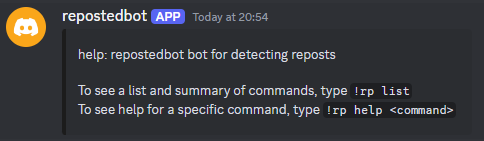

# repostedbot

A self-hosted discord bot written in go to detect reposts, keeping tally and linking to the previous post.

Mostly cribbed from examples but some interesting things including parsing help from method comments at runtime using `embed`.

## Setup

1. `go install github.com/azekeil/repostedbot/cmd/repostedbot` (needs at least go 1.16 for `embed`)
1. [Get a discord bot token and add the bot to your discord server(s)](https://www.writebots.com/discord-bot-token/). For bot permissions, you want:

   Text Permissions
   * Send Messages
   * Read Message History

1. Put your bot token in a file named `config.yaml` like so:
   ```yaml
   token: abc123
   ```
   `repostedbot` searches for `config.yaml` in the current working directory, then `~/.config/repostedbot/`
1. Run `repostedbot`. It should show:
   ```
   2021/11/21 17:47:16 Bot is now running.  Press CTRL-C to exit.
   ```
   And it should join your server you invited it to (you did do that as part of step 2, right?)

## Using

In a text channel `repostedbot` has permissions to read and write messages, enter `!rp`. You should see:

